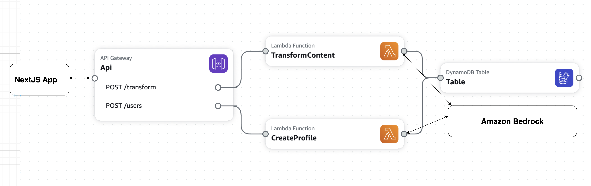

# CogniWeave: An Edge-Native AI Fabric for Cognitive Accessibility

Every mind is unique, but our digital world is one-size-fits-all. For millions of students with dyslexia, ADHD, and other learning differences, the internet is a wall of text. CogniWeave is a revolutionary AI fabric that runs on the edge to rebuild that wall, brick by brick, in real-time. It's not a tool or an app; it's a personalized accessibility layer for the entire web, dynamically reformatting text, summarizing content, and removing distractions to match each user's cognitive needs, creating a truly equitable and barrier-free learning experience for all.

---

## Table of Contents

- [Vision and Impact](#vision-and-impact)
- [Core Innovation](#core-innovation)
- [Solution Architecture](#solution-architecture)
- [Key Features](#key-features)
- [Technology Stack](#technology-stack)
- [Getting Started: MVP Demonstration](#getting-started-mvp-demonstration)
- [Testing the AI: Sample Prompts](#testing-the-ai-sample-prompts)
- [Future Vision](#future-vision)

---

## Vision and Impact

A significant portion of the student population (15-20%) is neurodivergent, facing substantial challenges in digital learning environments designed for a neurotypical majority. Current assistive technologies are often siloed, reactive, and create a fragmented user experience. CogniWeave addresses this "Cognitive Accessibility Chasm" by providing a proactive, personalized, and private solution that adapts the learning environment to the learner, not the other way around.

The potential impact is transformative:

- **For Students:** Drastically reduces cognitive load, improves comprehension, and fosters a more positive and engaging learning experience.
- **For Institutions:** Enables proactive compliance with accessibility mandates (e.g., ADA, FERPA) and provides powerful, anonymized analytics to improve curriculum design for all students.
- **For Society:** Creates a blueprint for privacy-preserving, real-time AI applications that can be extended to corporate, healthcare, and government sectors.

## Core Innovation

CogniWeave introduces a paradigm shift from discrete assistive tools to a persistent, personalized adaptive environment. This innovation is built on three pillars:

1.  **Real-Time & Proactive Transformation:** CogniWeave intercepts and re-renders web content _as it loads_. It's a browser extension or OS-level service that prevents the user from ever being confronted with the "wall of text," ensuring a fluid, uninterrupted experience with millisecond latency.

2.  **Context-Aware Hyper-Personalization:** Moving beyond one-size-fits-all settings, CogniWeave uses a sophisticated initial onboarding process powered by a large language model (LLM) to create a dynamic and nuanced cognitive profile. This profile continuously informs the AI to tailor content simplification, summarization, and visual layout to the user's specific needs in real-time.

3.  **Edge-Native Architecture:** The core AI transformation logic runs on an edge compute node (e.g., the user's local machine, an AWS Snowcone in a school, or an AWS Wavelength Zone). This is the critical architectural choice that solves the privacy-vs-latency dilemma, ensuring sensitive user data remains private while delivering the ultra-low latency required for a seamless experience.

## Solution Architecture

CogniWeave is a distributed, tri-layer system designed to optimize for responsiveness, privacy, and the strategic application of powerful AI.



### 1. Client-Side Agent (Browser Extension / Mobile Service / Next.JS Web Application)

- **Function:** Intercepts raw web content, communicates with the Edge Compute Layer, and renders the transformed content back into the DOM.
- **Technologies:** Next.JS for Web, Chrome/Firefox Browser Extension, Expo for mobile.

### 2. Edge Compute Layer (The Heart of Real-Time Transformation)

- **Function:** Hosts a specialized, distilled "student" LLM that performs the real-time content transformation based on the user's cognitive profile.
- **Technologies:** Distilled LLM (trained via Amazon SageMaker), NVIDIA NIM for GPU optimization, running on a local machine, AWS Snowcone, or AWS Wavelength.

### 3. The AWS Cloud Backend (The Intelligence Hub)

- **Function:** Handles heavy-lifting, non-real-time tasks like initial profile generation, AI model training, and institutional analytics.
- **Key AWS Services:**
  - **Amazon SageMaker:** Used for AI research, development, and crucially, for **model distillation**, creating the efficient models deployed to the edge.
  - **Amazon Bedrock:** Provides API access to powerful foundation models (e.g., **Anthropic's Claude 3.5 Sonnet**) for the initial, nuanced user profile generation and for advanced agentic features.
  - **Amazon Q Business:** Future versions will be integrated into an administrative dashboard, allowing educators to ask natural language questions about **anonymized, aggregated usage data** to gain actionable insights for curriculum improvement.
  - **Amazon S3 & DynamoDB:** Provide scalable and secure storage for model artifacts, user profiles, and application settings.

---

## Key Features

### Web Application & Dashboard

- *New: Chrome and Firefox extension support in development*

- **Onboarding Wizard:** A simple, guided questionnaire that uses a powerful cloud LLM (via Amazon Bedrock) to generate a detailed cognitive profile.
- **Dynamic Profile Visualization:** An intuitive dashboard for users to view and fine-tune their profile settings (e.g., summary length, distraction sensitivity).
- **Essay, Text Or Paragraph Simplification**: Paste your complex text or upload a PDF, and we'll transform it into clear, easy‑to‑understand language.
- **Optimized Performance:** Built with Next.js 15, React 19, and the React Compiler for a blazing-fast and responsive user interface.


- *Target Audience Tiers: Adapt text simplification to each audience's proficiency, ensuring the output aligns with their level of understanding in development.*
- *Professional Mode: Activate a mode that lets users select words or sentences for in-depth analysis and simplification in development.*
- *Re-simplify Sentence: Select any sentence to simplify it further in development.* 
- *Vocabulary Sidebar: Each selected word is added only once to the sidebar for quick access to its definition and synonyms in development.* 


### Mobile Application

- **Unified Design:** Built with Expo and NativeWind to share the same styling and design language as the web app for a consistent cross-platform experience.
- **OS-Level Integration:** A "Share to CogniWeave" feature allows users to send content from any app to be transformed and displayed in a clean-reader view.

### Multi-Modal AI Experience

- **Text-to-Speech (TTS):** Transformed text can be converted to natural-sounding speech using **Amazon Polly**.
- **Visual Simplification:** Future capabilities can leverage **Amazon Rekognition** to analyze and simplify complex images and diagrams.
- **Agentic AI:** Future versions will use **Amazon Bedrock Agents** to allow users to ask interactive questions about the content ("Explain this like I'm 10").

---

## Technology Stack

| Category                  | Technology / Service                                                                          |
| ------------------------- | --------------------------------------------------------------------------------------------- |
| **Frontend & Web**        | Next.js 15, React 19, Tailwind CSS v4, shadcn/ui                                              |
| **Mobile**                | Expo, React Native, NativeWind                                                                |
| **AI Model Training**     | **Amazon SageMaker** (Model Distillation, Training Jobs, Studio)                              |
| **AI Inference & Agents** | **Amazon Bedrock** (Claude 3.5 Sonnet), **Amazon Q Business**, Distilled Edge LLM, NVIDIA NIM |
| **Cloud Backend**         | **Amazon S3**, **Amazon DynamoDB**                                                            |
| **Multi-Modal AI**        | **Amazon Polly** (Text-to-Speech), **Amazon Rekognition** (Image Analysis)                    |
| **Edge Computing**        | Local Machine, **AWS Snowcone**, **AWS Wavelength**                                           |

---

## Getting Started: Web and Browser Extension

This plan outlines how to demonstrate the core end-to-end functionality of CogniWeave.

### Step 1: User Onboarding (Web Dashboard)

1.  **Action:** Open the CogniWeave Dashboard web application.
2.  **Interact:** Complete the simple 3-question onboarding wizard.
    - _Example Questions:_ "How do you prefer to read long texts?", "How easily are you distracted by images?", "Do you prefer simple language?"
3.  **Technical Explanation:** When you submit, the form data is sent to an **Amazon Bedrock** API endpoint. The advanced reasoning of **Claude 3.5 Sonnet** analyzes these qualitative preferences and generates a detailed, quantitative cognitive profile JSON object. This happens once, in the cloud, for maximum accuracy.

### Step 2: Web Extension Activation

1.  **Action:** Navigate to a dense, complex webpage (e.g., a Wikipedia article on a scientific topic like "Cellular Respiration").
2.  **Observe:** Note the original, unmodified layout with long paragraphs and multiple images.
3.  **Activate:** Click the CogniWeave icon in the browser's toolbar to enable the service.

### Step 3: Real-Time Transformation

1.  **Action:** Observe the webpage content instantly and smoothly re-rendering.
2.  **Witness the Changes:**
    - Long paragraphs are broken into digestible 2-3 sentence chunks.
    - Complex vocabulary is replaced with simpler terms, with a tooltip to show the original word.
    - Distracting visual elements (sidebars, decorative images) are faded or hidden.
3.  **Technical Explanation:** This instantaneous transformation is the **core edge-native loop**. The browser extension intercepted the HTML, sent it to the locally running distilled AI model, which applied the user's cognitive profile rules, and sent back a structured JSON of the new content—all with millisecond latency. This showcases the power of **Amazon SageMaker's model distillation** for creating fast, private, and efficient edge AI.

---

## Testing the AI: Sample Prompts

The behavior of the CogniWeave AI is directed by structured JSON prompts.

### Prompt for Core Simplification (Edge LLM)

This prompt is sent from the client agent to the distilled LLM running on the edge for high-speed execution.

```json
{
  "task": "transform_content",
  "content": "<html>... a long, complex HTML snippet from a webpage...</html>",
  "profile": {
    "sentence_complexity": "low",
    "target_reading_level": "grade_8",
    "lexical_difficulty": "simple",
    "lexical_replacement_threshold": 0.85,
    "paragraph_chunking_strategy": "max_sentences_per_paragraph:3",
    "distraction_sensitivity": "high",
    "distraction_filter_targets": ["img.decorative", "aside", "iframe"],
    "learning_style": "none"
  },
  "output_format": "structured_json_v1"
}
```

### Prompt for Analogical Explanation (Cloud Bedrock Agent)

This prompt is used for an advanced, on-demand feature, leveraging the power of a cloud model where latency is less critical.

```json
{
  "task": "generate_analogy",
  "topic": "Quantum Entanglement",
  "context": "The user is a high school student studying introductory physics. They have just read a simplified paragraph explaining that when two particles are entangled, measuring a property of one instantly influences the other, regardless of distance.",
  "target_audience": "high_school_student_no_prior_calculus",
  "style": "simple_and_relatable",
  "constraints": "Avoid complex mathematical formulas. Use a metaphor involving everyday objects. The explanation should be no more than 100 words."
}
```

---

## Future Vision

CogniWeave is designed for growth and societal impact.

- **Phase 1 (Refinement & Validation):** Harden the MVP and establish pilot programs with educational institutions and accessibility advocacy groups to gather real-world data.
- **Phase 2 (Commercialization):** Pursue a B2B2C model, selling CogniWeave as an enterprise-grade accessibility platform to universities, school districts, and corporations. The **Amazon Q Business** analytics feature will be a key differentiator for institutional customers.
- **Phase 3 (Platform Expansion):** Evolve into a fundamental, OS-level accessibility layer with deep integrations into enterprise software suites (Amazon WorkMail, Amazon WorkSpaces, Amazon Chime, Amazon WorkDocs) and consumer platforms, making the entire digital world accessible to every type of mind.

<!-- end list -->


